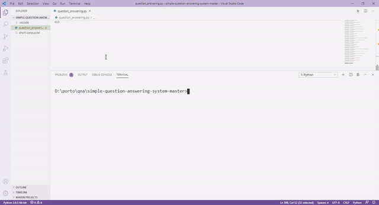

The system was created as the final project in Natural Language Processing subject using NLTK and Spacy. 
System can answer some given questions based on the Wikipedia page, talk about Earthquake and Tsunami in Sulawesi 2018.

